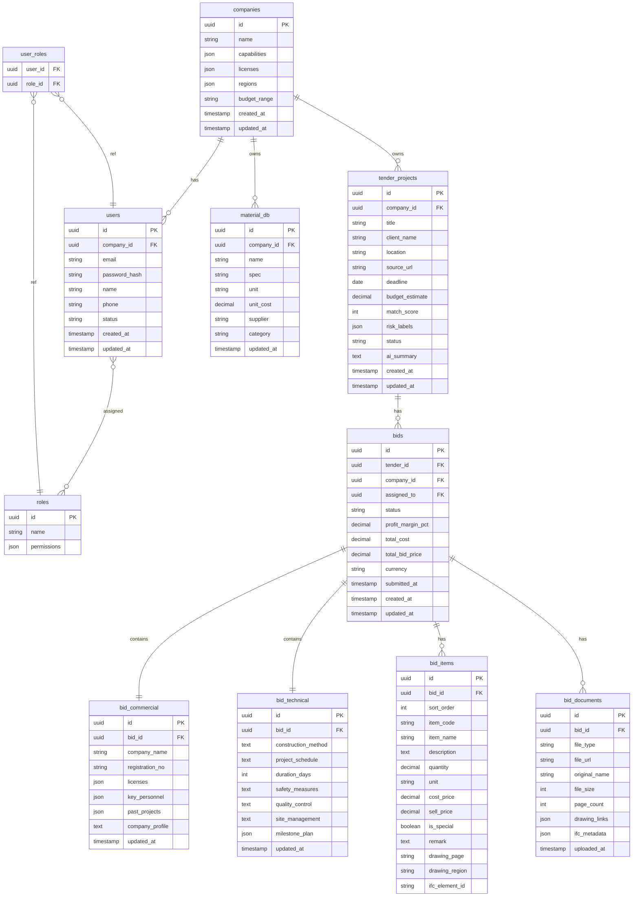

# 整体数据关系图

| 属性 | 值 |
|------|-----|
| 版本 | V1.0 |
| 日期 | 2026-05-19 |
| 范围 | 核心投标流程（用户/组织、招标、投标） |

---

## 核心实体一览

| 实体 | 说明 |
|------|------|
| `companies` | 公司/组织，系统最顶层租户单位 |
| `users` | 系统用户，归属某个公司 |
| `roles` | 角色定义（管理层 / 投标负责人） |
| `user_roles` | 用户-角色多对多关联 |
| `tender_projects` | 招标项目，来源于爬虫或手动录入 |
| `bids` | 投标，一个招标项目可有多个投标版本 |
| `bid_commercial` | 商务标：公司资质、业绩、人员 |
| `bid_technical` | 技术标：施工方案、工期、安全措施 |
| `bid_items` | 经济标明细：工程量清单各行 |
| `bid_documents` | 投标附件：PDF / DWG / IFC 文件 |
| `material_db` | 物料资料库，用于经济标定价参考 |

---

## ER 图（Mermaid）



---

## 关键关系说明

### 1. 租户隔离

- 所有业务数据通过 `company_id` 隔离，不同公司数据完全独立。
- `tender_projects` 和 `bids` 均带 `company_id`，支持多租户查询过滤。

### 2. 投标三标结构

每个 `bid` 拥有：

| 子实体 | 类型 | 说明 |
|--------|------|------|
| `bid_commercial` | 1:1 | 商务标 — 资质证明、业绩、人员 |
| `bid_technical` | 1:1 | 技术标 — 施工方案、工期、安全 |
| `bid_items` | 1:N | 经济标 — 工程量清单各明细行 |

三标内容均存于独立表，便于分阶段填写和独立审查。

### 3. 投标状态流转

```
DRAFT → IN_REVIEW → APPROVED → SUBMITTED → [WON | LOST]
```

### 4. 文件关联

`bid_documents` 存储上传的 PDF/DWG/IFC 文件引用（S3 URL），`bid_items` 中的 `drawing_page` / `drawing_region` / `ifc_element_id` 字段实现项目清单与图纸/BIM 构件的双向定位。

---

## 状态枚举

### `tender_projects.status`

| 值 | 含义 |
|----|------|
| `PENDING` | 待决策 |
| `DECIDED` | 已决定投标 |
| `DECLINED` | 放弃投标 |
| `BIDDING` | 投标进行中 |
| `SUBMITTED` | 已提交 |
| `WON` | 中标 |
| `LOST` | 未中标 |

### `bids.status`

| 值 | 含义 |
|----|------|
| `DRAFT` | 草稿编辑中 |
| `IN_REVIEW` | 内部审查中 |
| `APPROVED` | 审查通过 |
| `SUBMITTED` | 已提交业主 |
| `WON` | 中标 |
| `LOST` | 未中标 |

---

## 文件列表

| 文件 | 内容 |
|------|------|
| [01-auth.md](./01-auth.md) | 用户注册、登录、JWT 认证、权限 |
| [02-organization.md](./02-organization.md) | 公司/组织创建与管理、成员管理 |
| [03-tender.md](./03-tender.md) | 招标项目创建与管理 |
| [04-bid.md](./04-bid.md) | 投标核心流程：商务标、技术标、经济标 |
